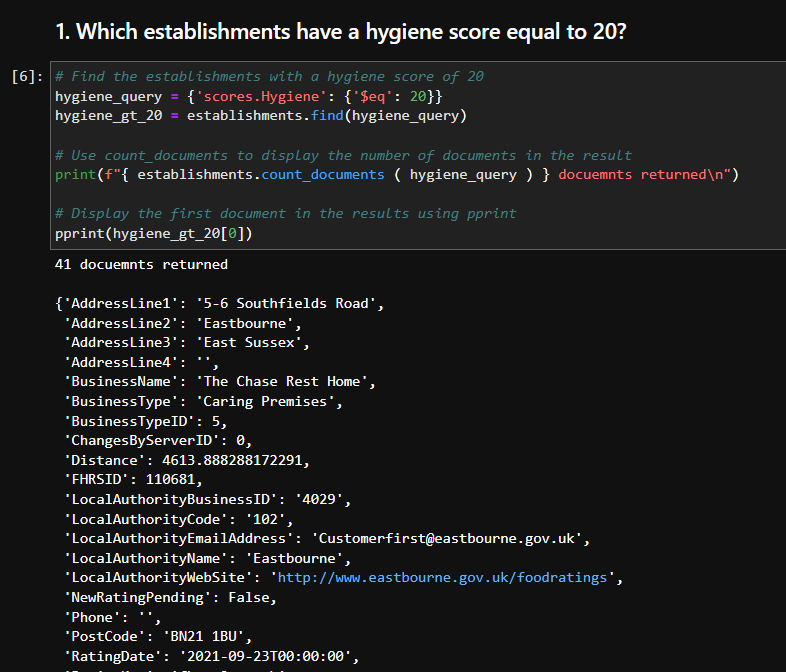

**Scenario:** The UK Food Standards Agency evaluates various establishments across the United Kingdom, and gives them a food hygiene rating. You've been contracted by the editors of a food magazine, Eat Safe, Love, to evaluate some of the ratings data in order to help their journalists and food critics decide where to focus future articles.
-----
### *Screenshot*  

-----
*JSON file is in the resources directory*

📦nosql-challenge   
 ┣ 📂Resources   
 ┃ ┗ 📜establishments.json   
 ┣ 📜NoSQL_analysis_starter.ipynb      
 ┣ 📜NoSQL_setup_starter.ipynb   
 ┣ 📜README.md   
 ┗ 📜screenshot.png
